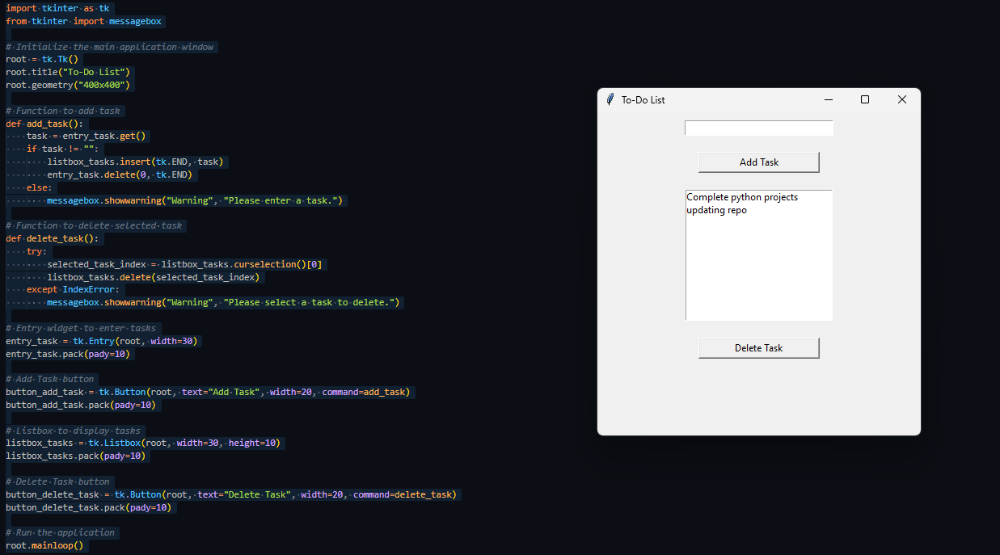

# To-Do List Application (Tkinter)

## Project Overview
This is a simple To-Do List application built using Python's Tkinter library. The application allows users to add and delete tasks, helping them manage their daily to-do list effectively.

## Features
- **Add Tasks**: Easily add tasks to the to-do list.
- **Delete Tasks**: Remove tasks from the list once completed.

## Requirements
- **Python** (version 3.x)
- **Tkinter** (included with Python's standard library)

## Installation and Usage
1. **Clone the repository** or **download** the code files.
2. Run the following command to start the application:
   ```bash
   python to_do_list.py
   ```
3. Use the input box to add new tasks and the **Add Task** button to save them to the list.
4. Select a task and click **Delete Task** to remove it from the list.

## Code Explanation
- **`tkinter.Listbox`** is used to display the list of tasks.
- **`tkinter.Entry`** allows the user to input new tasks.
- Functions:
  - **`add_task()`**: Adds a task from the input field to the listbox.
  - **`delete_task()`**: Deletes the selected task from the listbox.

## Project Structure
```
.
├── to_do_list.py            # Main application file
├── README.md                 # Project documentation
└── ProjectScreenshots/
    └── image.png             # Screenshot of the application
```

## Screenshot


## License
This project is open-source and available under the MIT License.

## Resources
For more information on Tkinter, refer to the [Tkinter documentation](https://docs.python.org/3/library/tkinter.html).
