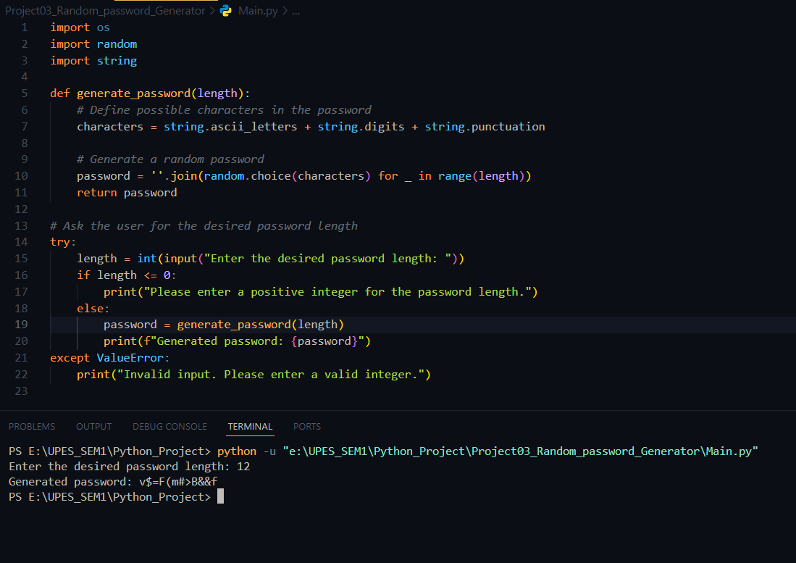

# Random Password Generator (Python)

## Project Overview
This project is a simple Random Password Generator script written in Python. The program generates a random password of a specified length, helping users create secure passwords for their accounts.

## Features
- **Generate Random Passwords**: Produces a random password based on a user-specified length.
- **Character Customization**: Uses a combination of uppercase letters, lowercase letters, digits, and special characters for strong password generation.

## Requirements
- **Python** (version 3.x)

## Installation and Usage
1. **Clone the repository** or **download** the code files.
2. Run the following command to start the script:
   ```bash
   python Main.py
   ```
3. Specify the desired password length when prompted, and a random password will be generated.

## Code Explanation
- The script uses the following modules:
  - **`os.urandom()`**: Provides a source of random bytes to ensure better randomness.
  - **`random.choice()`**: Selects random characters from a predefined set of characters.
- Functionality:
  - **`generate_password(length)`**: Takes the password length as input and generates a random password.

## Project Structure
```
.
├── Main.py                   # Main script for generating passwords
├── README.md                 # Project documentation
└── ProjectScreenshots/
    └── image.png             # Screenshot of the application
```

## Screenshot


## License
This project is open-source and available under the MIT License.

## Resources
For more information on the `random` module, refer to the [Python Random Module documentation](https://docs.python.org/3/library/random.html).
